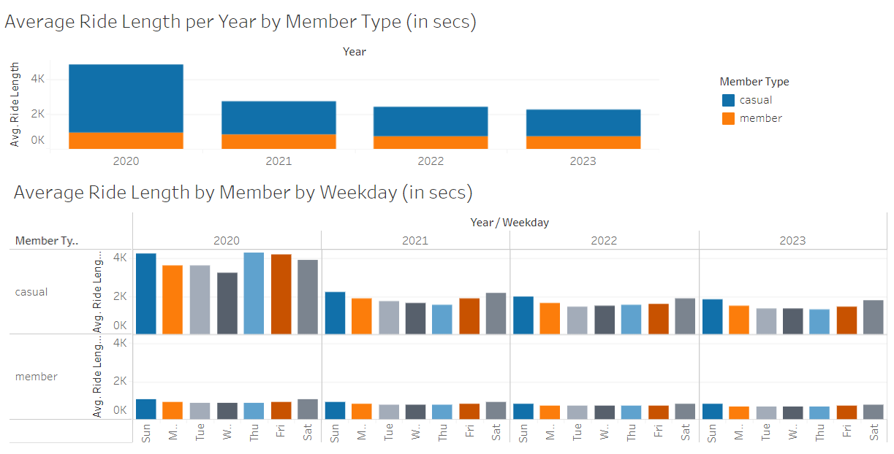
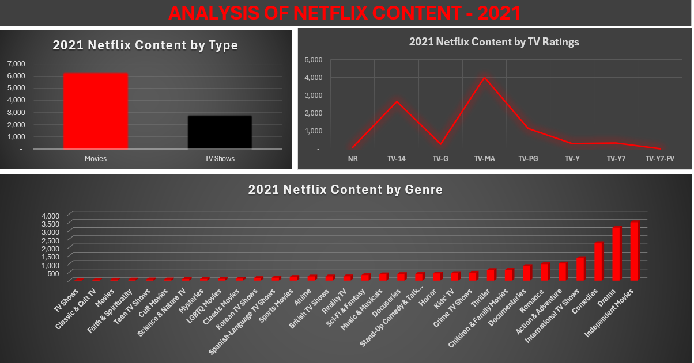

# Princess' Portfolio

## [Analysis of Cyclistic Bike-Share Usage by Membership Type in R](https://github.com/POsebi/padeniran_portfolio/blob/main/cyclistic2.R)

This is a case study I worked on in completion of my Googgle Data Analytics Professional Certicicate.

### Specific goals include:

1. Analyzing how annual members and casual riders use Cyclistic bikes differently between 2020 and 2023.
2. Garnering instights for marketing strategies to convert casual riders to members.

### Data Collection:

The [dataset](https://divvy-tripdata.s3.amazonaws.com/index.html) for this analysis was collected from a source provided by course with [license](https://divvybikes.com/data-license-agreement) and saved to my local device.

### Data Analysis Process:

The data analysis process, inclusive of data cleaning, exploratory data analysis, statistical analysis, and visualization was done within RStudio.

```
library(data.table)
setwd("C:\\Users\\Princess\\Documents\\Portfolio\\Case Study 1\\divvy_dataset")
files <- list.files(pattern = ".csv")
temp <- lapply(files, fread, sep = ",")
cyclistic_dataset <- rbindlist(temp)
```

Packages used include tidyverse, conflicted, lubridate, dpylr, ggplot2.

```
library(tidyverse)
library(conflicted)
conflict_prefer("filter", "dplyr")
conflict_prefer("lag", "dplyr")
conflict_prefer("month", "lubridate")
conflict_prefer("year", "lubridate")
conflict_prefer("day", "lubridate")
conflict_prefer("wday", "lubridate")
```

New columns were added, inaccuracies minimized, and dates formatted for easier analysis

```
all_trips$date <- as.Date(all_trips$started_at)
all_trips$month <- format(as.Date(all_trips$date), "%m")
all_trips$day <- format(as.Date(all_trips$date), "%d")
all_trips$year <- format(as.Date(all_trips$date), "%Y")
all_trips$day_of_week <- format(as.Date(all_trips$date), "%a")
all_trips$ride_length <- difftime(all_trips$ended_at,all_trips$started_at)
all_trips_v2 <- all_trips[!(all_trips$start_station_name == "HQ QR" | all_trips$ride_length<0),]
```

Statistical Analysis was conducted on new dataframe

```
summary(all_trips_v2$ride_length)
#straight average (total ride length / rides)
mean(all_trips_v2$ride_length) 
#midpoint number in the ascending array of ride lengths
median(all_trips_v2$ride_length) 
#longest ride
max(all_trips_v2$ride_length)
#shortest ride
min(all_trips_v2$ride_length)
```
Comparison between casual and member users was conducted
```
aggregate(all_trips_v2$ride_length ~ all_trips_v2$member_casual, FUN = mean)
aggregate(all_trips_v2$ride_length ~ all_trips_v2$member_casual, FUN = median)
aggregate(all_trips_v2$ride_length ~ all_trips_v2$member_casual, FUN = max)
aggregate(all_trips_v2$ride_length ~ all_trips_v2$member_casual, FUN = min)
aggregate(all_trips_v2$ride_length ~ all_trips_v2$member_casual + all_trips_v2$day_of_week,
          FUN = mean)
all_trips_v2$day_of_week <- ordered(all_trips_v2$day_of_week, levels=c("Sun", "Mon", "Tue", "Wed", "Thu", "Fri", "Sat"))
aggregate(all_trips_v2$ride_length ~ all_trips_v2$member_casual + all_trips_v2$day_of_week,
          FUN = mean)
all_trips_v2 %>%
  mutate(weekday = wday(started_at, label = TRUE)) %>%
  group_by(member_casual, weekday) %>% 
  summarise(number_of_rides = n(), average_duration = mean(ride_length)) %>%
  arrange(member_casual, weekday)
```

Several visualizations were done to understand data better, see below example;
```
all_trips_v2 %>%
  mutate(weekday = wday(started_at, label = TRUE)) %>%
  group_by(member_casual, weekday) %>%
  summarise(number_of_rides = n()
            ,average_duration = mean(ride_length)) %>%
  arrange(member_casual, weekday) %>%
  ggplot(aes(x = weekday, y = average_duration, fill = member_casual)) +
  geom_col(position = "dodge")
```

Summary was finally exported for further analysis in Tableau
```
  counts <- aggregate(all_trips_v2$ride_length ~ all_trips_v2$member_casual +
                        all_trips_v2$day_of_week + all_trips_v2$month + all_trips_v2$year, FUN = mean)
  write.csv(counts, file = 'avg_ride_length.csv')
```
### Overview of Analysis Results:



### Interpretation & Conclusion:
In this data analysis case study, I was able to conclude that overall ride length dropped significantly in 2021 from 2020, and has steadily declined since then till 2023. While the decline is seen in both member types, it is more evident in casual members.etc. 

### Recommendations:


## [Exploring 2021 Netflix Content Trends in Excel](https://github.com/POsebi/padeniran_portfolio/blob/main/2021_neflix_content_analysis.xlsx)

This is a project I worked on as the dataset spiked my interest as a major Netflix viewer. This analysis focuses on Netflix's content in the year 2021. The analysis aims to explore trends, patterns, and garner insights regarding the types of content released and the streaming platform's content strategy during that year.

### Specific goals include:

1. Analyzing the distribution of different types of content (e.g., movies, TV shows).
2. Identifying popular genres and themes among Netflix releases.

### Data Collection:

The [dataset](https://www.kaggle.com/datasets/rahulvyasm/netflix-movies-and-tv-shows) for this analysis was collected from a publicly available source, Kaggle.

### Data Analysis Process:

1. Data Cleaning: The csv dataset was largely unclean and cleaning it for analysis took the significant portion of the entire time of the analysis. These include correcting errors & formatting dates in power query, removing irrelevant inputs (such as shows released in 2024), removing duplicate entries, and re-entering inputs in wrong columns. Another important part of the cleaning process was unifying the inconsistent TV rating system. I decided to go with the TV Parental Guidelines Monitoring Board's [guidelines](http://www.tvguidelines.org/ratings.html).

2. Exploratory Data Analysis (EDA): Initial exploratory analysis was conducted to understand the distribution and characteristics of the data. I used the pivot table to explore the rows, columns, and easily identify unique inputs.

3. Statistical Analysis: Simple statistical Excel functions (e.g. MIN, MAX, COUNTA) were employed to further explore the data and view trends within the data.

4. Visualization: Column and bar charts were plotted to present key findings and insights clearly and concisely.

5. Interpretation: The results of the analysis were interpreted to extract meaningful insights about Netflix's content landscape in 2021.

### Overview of Analysis Results:



### Conclusion:
Through this data analysis project, I was able to conclude that in 2021, Netflix added movies two-times more than TV shows to its platform. This was interesting to note, considering Netflix is well-known for its popular TV shows such as 'Stranger Things', 'Orange Is the New Black', etc. Also, the original release dates of Netflix's content as of 2021 spanned 96 years - earliest in 1925, showing the platform's content diversity for different age groups. A significant portion on Netflix's content were meant for mature audiences and, over half for persons older than 14 only. This is not surprising, considering the bulk of the platform's customers are expected to be old enough to work and earn, to pay the monthly subscriptions.

In terms of genre preferences, the platform leaned heavily towards independent Movies, Dramas, Comedies, and International TV shows, significantly much more than genres like Action & Adventure. This trend may be as a result of what the world was experiencing post-pandemic shutdown, and viewers' need for an escape. It could also mean that a larger base of the platform's consumers are women who are known to lean more towards these genres.

Additional data and analysis before, during, and after this period will be needed to further ascertain or discredit this conclusion.
