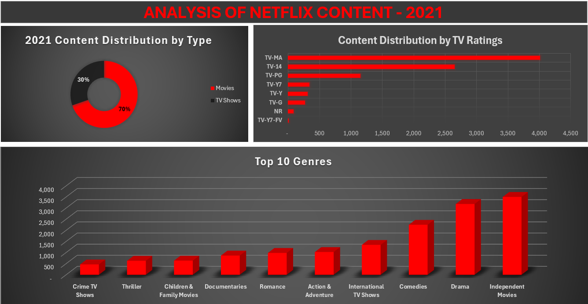

# Princess' Portfolio

## [Prescriptive Data Analysis on Global Companies Financial Landscape using Power BI](https://github.com/POsebi/padeniran_portfolio/blob/main/global_companies_financial_landscape.pbix)

### [Dashboard Link:](https://app.powerbi.com/groups/me/reports/4ae17a95-6e70-448f-b7c5-26aeb3acbe09/8a0cb228b6d4fd9a49d0?experience=power-bi)
Please, reach out to me for access via email if needed - princessadeniran@gmail.com

### Questions I Want Answered:

1. Countries to look out for when making overall investment decisions.
2. Countries to look out for when making long-term vs short-term investment decisions.

### Data Collection:

The [dataset](https://www.kaggle.com/datasets/patricklford/largest-companies-analysis-worldwide/data) for this analysis was collected from open-source site, Kaggle, provided by Patrick L Ford [license](https://opendatacommons.org/licenses/dbcl/1-0/). It shows trailing twelve months capital market metrics of the companies listed as at the time it was generated.

### Data Analysis Process:
1. Loaded data into Power BI, cleaned data in Power Query e.g countries showing duplicate names (United States, USA).
2. Performed a quick overview on my data using charts, cards, and measures to identify patterns and validate data.   
   ```e.g.
   ``` average mark.cap by country
       AVERAGEX(
             VALUES(Companies_ranked_by_Dividend_Yield[country]),
             CALCULATE(AVERAGE(Companies_ranked_by_Market_Cap[marketcap])))```
     
3. Noticed some issues with the dataset, such as, companies throwing off average p/e ratio, revenue returning negatives.
4. Addressed issues with dataset by taking out the outliers and transforming revenue column into absolute values.
5. Created a measure table to perform necessary calculations in readiness for visualization.
6. Created visuals to intepret data and generate insights, and summarasized them by pages.
7. Page 1 - landing page and home tab.
8. Page 2 - shows overview of totals and avergaes and how they compare.
9. Page 3 - explores the number of company options available per country for an investor that would like to dversify.
10. Page 4 - summarizes averages by country.
11. Page 5 - correlation of other metrics to dividend yield.
12. Page 6 -a quick user guide defining the variables used in analysis and to assist in navigating the dashboard.
13. Edited mobile version of dashboard.
14. Published dashboard to Power BI Service.

### Overview of Analysis:


9,909 companies and 78 countries were reviewed in total. Average market capitalization is £8.7bn and average revenue £5.7bn while average earnings is £0.7bn.

### Insights:
- Compared to market capitalization, revenue and earnings are low. This results in a high price-to-sale ratio and could mean many companies are over-valued. The average investor is spending £1.5 to genrate £1 in revenue. This looks bleak at first, however, it could also reflect general investor confidence in the growth potential of the companies. For short-term investors, high market capitalization while considering other metrics, may be good enough reason to invest.  As a long-term investor, it's best to look towards countries like Austria, Chile, Hungary where the average revenue trends above average market capitalization, and earnings are as high as 30% relative to market capitalization.
- The United States leads in terms of companies performing better than average on all parameters, making it a good country to look into for both long-term and short-term investing. Countries such as India, Canada, Japan, Australia, Germany, United Kingdom, China, and France also follow behind in terms of consistency. However, we have countries like Sweden that may be good for short-term investments but not necessarily great for long-term investing. This is because while it has many companies represented in terms of market capitalization and revenue, it may not be the most profitable as it is missing from the leading countries when it comes to metrics like, earnings, p/e ratio and dividend yield. Alternatively, we see countries like Saudi Arabia that are primed mainly for long-term investments based on the metrics it is seen leading.

         
- While observing average performance by country, we get a clearer view. In this case, the United States is nowhere to be found in terms of revenue, earnings, p/e ratio and dividend yield. Instead we have countries like Ireland and China dominating in terms of average market capitalization, countries like Hungary recording high revenue, earnings, and dividend yield while maintaing low p/e ratio, and countries like Kuwait having grossly over-valued companies.
  


### Recommendations for Further Analysis:

1. Due to the overrepresentation of countries like the US, and underrepresentaion of countries like Nigeria in the dataset, this analysis could be biased. More data with better representation is needed.
3. Data used is static. This analysis only serves as a guide on how to approach global capital market investments and should not be used for future investment decisions. It is recommended to seek professional financial advise before making significant investment decisions.

## [Cyclistic Bike-Share Usage by Rider Type in R, Visualized on Tableau](https://github.com/POsebi/padeniran_portfolio/blob/main/cyclistic2.R)

This is a case study I worked on in completion of my Google Data Analytics Professional Certificate.

### Specific goals include:

1. Analyzing how annual members and casual riders use Cyclistic bikes differently between 2020 and 2023.
2. Garnering instights for marketing strategies to convert casual riders to members.

### Data Collection:

The [dataset](https://divvy-tripdata.s3.amazonaws.com/index.html) for this analysis was collected from a source provided by course with [license](https://divvybikes.com/data-license-agreement) and saved to my local device.

### Data Analysis Process:

The data analysis process, inclusive of data cleaning, exploratory data analysis, statistical analysis, and visualization was done within RStudio.

```
library(data.table)
setwd("C:\\Users\\Princess\\Documents\\Portfolio\\Case Study 1\\divvy_dataset")
files <- list.files(pattern = ".csv")
temp <- lapply(files, fread, sep = ",")
cyclistic_dataset <- rbindlist(temp)
```

Packages used include tidyverse, conflicted, lubridate, dpylr, ggplot2.

```
library(tidyverse)
library(conflicted)
conflict_prefer("filter", "dplyr")
conflict_prefer("lag", "dplyr")
conflict_prefer("month", "lubridate")
conflict_prefer("year", "lubridate")
conflict_prefer("day", "lubridate")
conflict_prefer("wday", "lubridate")
```

New columns were added, inaccuracies minimized, and dates formatted for easier analysis

```
all_trips$date <- as.Date(all_trips$started_at)
all_trips$month <- format(as.Date(all_trips$date), "%m")
all_trips$day <- format(as.Date(all_trips$date), "%d")
all_trips$year <- format(as.Date(all_trips$date), "%Y")
all_trips$day_of_week <- format(as.Date(all_trips$date), "%a")
all_trips$ride_length <- difftime(all_trips$ended_at,all_trips$started_at)
all_trips_v2 <- all_trips[!(all_trips$start_station_name == "HQ QR" | all_trips$ride_length<0),]
```

Statistical Analysis was conducted on new dataframe

```
summary(all_trips_v2$ride_length)
#straight average (total ride length / rides)
mean(all_trips_v2$ride_length) 
#midpoint number in the ascending array of ride lengths
median(all_trips_v2$ride_length) 
#longest ride
max(all_trips_v2$ride_length)
#shortest ride
min(all_trips_v2$ride_length)
```
Comparison between casual and member users was conducted
```
aggregate(all_trips_v2$ride_length ~ all_trips_v2$member_casual, FUN = mean)
aggregate(all_trips_v2$ride_length ~ all_trips_v2$member_casual, FUN = median)
aggregate(all_trips_v2$ride_length ~ all_trips_v2$member_casual, FUN = max)
aggregate(all_trips_v2$ride_length ~ all_trips_v2$member_casual, FUN = min)
aggregate(all_trips_v2$ride_length ~ all_trips_v2$member_casual + all_trips_v2$day_of_week,
          FUN = mean)
all_trips_v2$day_of_week <- ordered(all_trips_v2$day_of_week, levels=c("Sun", "Mon", "Tue", "Wed", "Thu", "Fri", "Sat"))
aggregate(all_trips_v2$ride_length ~ all_trips_v2$member_casual + all_trips_v2$day_of_week,
          FUN = mean)
all_trips_v2 %>%
  mutate(weekday = wday(started_at, label = TRUE)) %>%
  group_by(member_casual, weekday) %>% 
  summarise(number_of_rides = n(), average_duration = mean(ride_length)) %>%
  arrange(member_casual, weekday)
```

Several visualizations were done to understand data better, see below example;
```
all_trips_v2 %>%
  mutate(weekday = wday(started_at, label = TRUE)) %>%
  group_by(member_casual, weekday) %>%
  summarise(number_of_rides = n()
            ,average_duration = mean(ride_length)) %>%
  arrange(member_casual, weekday) %>%
  ggplot(aes(x = weekday, y = average_duration, fill = member_casual)) +
  geom_col(position = "dodge")
```

Summary was finally exported for further analysis in Tableau
```
  counts <- aggregate(all_trips_v2$ride_length ~ all_trips_v2$member_casual +
                        all_trips_v2$day_of_week + all_trips_v2$month + all_trips_v2$year, FUN = mean)
  write.csv(counts, file = 'avg_ride_length.csv')
```
### Overview of Analysis Results:


### Interpretation & Conclusion:
In this data analysis case study, I was able to conclude that overall ride length dropped significantly in 2021 from 2020, and has steadily declined since then till 2023. While the decline in ride length is seen in both member types, it is more evident in casual members.etc. Interesting, the number of rides have grown for both member types in the same period, 59% in 2021 and up to 62% in 2023. Between 2021 and 2023, ridelengths tend to peak in the weekends for casual riders and stay relatively constant for member riders. From the data, it can also be concluded that member riders make more but shorter trips than casual riders.               

### Recommendations:

1. Emphasize the advantages of becoming a member, such as discounted rates per ride, priority booking, and a free month trial for new members. It is important to make these benefits clear and prominent in the marketing materials.
2. Since ride lengths peak on weekends for casual riders, leveraging this insight by launching weekend-specific promotions to attract casual riders to become members could be very beneficial.
3. Continuously gather feedback from both casual and member riders to understand their pain points and preferences. To use this feedback to improve the membership offering, address concerns, and enhance the overall user experience to attract more casual riders to convert to members.

## [Exploring 2021 Netflix Content Trends in Excel](https://github.com/POsebi/padeniran_portfolio/blob/main/2021_neflix_content_analysis.xlsx)

This is a project I worked on as the dataset spiked my interest as a major Netflix viewer. This analysis focuses on Netflix's content in the year 2021. The analysis aims to explore trends, patterns, and garner insights regarding the types of content released and the streaming platform's content strategy during that year.

### Specific goals include:

1. Analyzing the distribution of different types of content (e.g., movies, TV shows).
2. Identifying popular genres and themes among Netflix releases.

### Data Collection:

The [dataset](https://www.kaggle.com/datasets/rahulvyasm/netflix-movies-and-tv-shows) for this analysis was collected from a publicly available source, Kaggle.

### Data Analysis Process:

1. Data Cleaning: The csv dataset was largely unclean and cleaning it for analysis took the significant portion of the entire time of the analysis. These include correcting errors & formatting dates in power query, removing irrelevant inputs (such as shows released in 2024), removing duplicate entries, and re-entering inputs in wrong columns. Another important part of the cleaning process was unifying the inconsistent TV rating system. I decided to go with the TV Parental Guidelines Monitoring Board's [guidelines](http://www.tvguidelines.org/ratings.html).

2. Exploratory Data Analysis (EDA): Initial exploratory analysis was conducted to understand the distribution and characteristics of the data. I used the pivot table to explore the rows, columns, and easily identify unique inputs.

3. Statistical Analysis: Simple statistical Excel functions (e.g. MIN, MAX, COUNTA) were employed to further explore the data and view trends within the data.

4. Visualization: Column and bar charts were plotted to present key findings and insights clearly and concisely.

5. Interpretation: The results of the analysis were interpreted to extract meaningful insights about Netflix's content landscape in 2021.

### Overview of Analysis Results:



### Conclusion:
Through this data analysis project, I was able to conclude that in 2021, Netflix added movies two-times more than TV shows to its platform. This was interesting to note, considering Netflix is well-known for its popular TV shows such as 'Stranger Things', 'Orange Is the New Black', etc. Also, the original release dates of Netflix's content as of 2021 spanned 96 years - earliest in 1925, showing the platform's content diversity for different age groups. A significant portion on Netflix's content were meant for mature audiences and, over half for persons older than 14 only. This is not surprising, considering the bulk of the platform's customers are expected to be old enough to work and earn, to pay the monthly subscriptions.

In terms of genre preferences, the platform leaned heavily towards independent Movies, Dramas, Comedies, and International TV shows, significantly much more than genres like Action & Adventure. This trend may be as a result of what the world was experiencing post-pandemic shutdown, and viewers' need for an escape. It could also mean that a larger base of the platform's consumers are women who are known to lean more towards these genres.

Additional data and analysis before, during, and after this period will be needed to further ascertain or discredit this conclusion.
